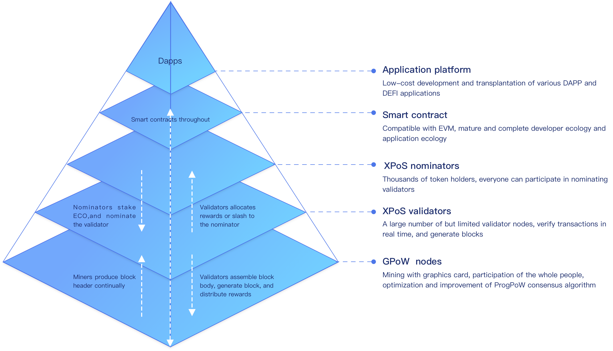

# Technical architecture

The EcoBall blockchain system adopts the GPoW+ hybrid consensus mechanism, and its core technical architecture is shown in the following figure:

## GPoW consensus mechanism

EcoBall uses the GPoW consensus mechanism derived from the ProgPOW consensus algorithm. Miners know that Ethereum uses the ETHash algorithm, but due to the relatively low execution efficiency and utilization of the ETHash algorithm on the GPU, ProgPOW has been modified based on ETHash to maximize the utilization of the GPU and is aimed at the blockchain community For mining needs, the mainstream GPU (such as AMD’s Polaris and Vega series GPU and NVIDIA’s Pascal series GPU) have been specially optimized.

## XPoS consensus mechanism

The XPoS consensus mechanism selects verification nodes through voting by token holders. The verification node verifies transactions and generates blocks, which greatly improves the efficiency of transaction verification, shortens the block generation time, and improves the efficiency of the POS consensus mechanism, and improves the insufficient participation and vulnerability of token holders to Noting-at-stake" attack and "long-range" attack.

## Smart contract platform

Smart contracts are codes that automatically process business logic on the blockchain, which can effectively reduce the cost of trust in business transactions, help promote the establishment and development of a new generation of business models, and provide important technical guarantees for people to enter the intelligent era. The smart contract of the EcoBall blockchain is fully compatible with Ethereum, and the smart contract code written for Ethereum can be easily transplanted.

## DAPP development platform

As a decentralized application platform, the EcoBall blockchain can carry a large number of decentralized applications, including the currently popular Decentralized Finance (Defi). EcoBall provides developers with a variety of programming interfaces to develop DAPP, including RESTful API and SDK for various major programming languages.

